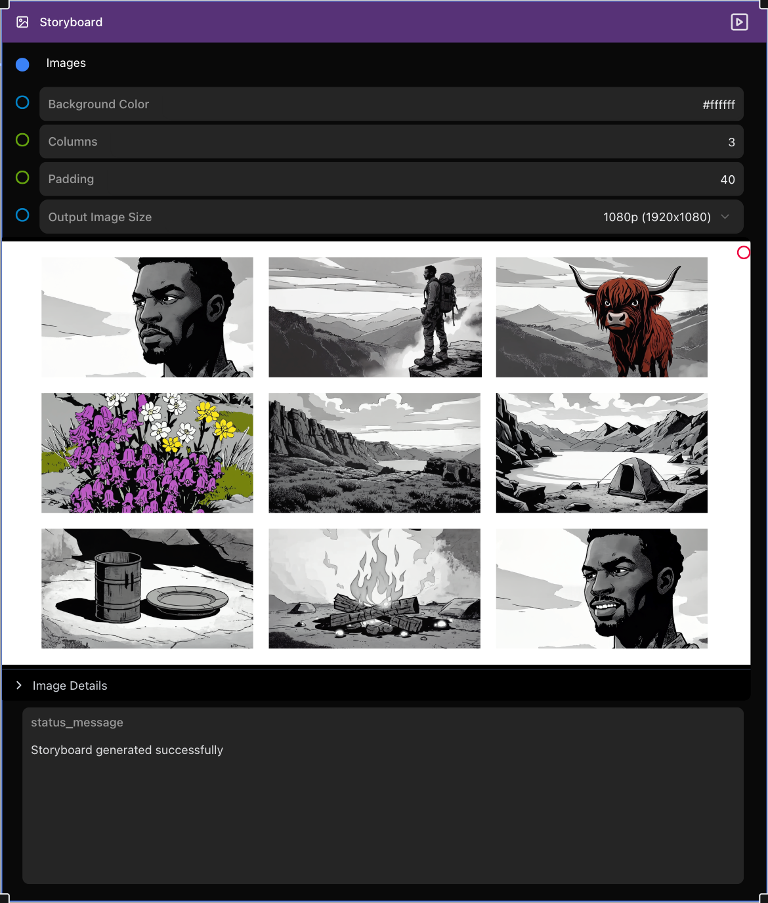

# Griptape Nodes Library: Storyboard

A Griptape Nodes library for creating storyboard grid layouts from multiple images. This library allows you to arrange images in a grid pattern with customizable layouts, resulting in a single composite image.

## Features

- Create image grids with customizable layouts
- Support for multiple image sources (ImageArtifact and ImageUrlArtifact)
- Control number of columns, padding, and background color
- Automatically centers incomplete rows for balanced layouts
- Output in standard resolutions (4K, 1440p, 1080p, 720p)
- Preserves image aspect ratios while creating uniform grids

## Installation

Clone this repository into your Griptape Nodes workspace:

```bash
cd /path/to/your/griptape-nodes-workspace
git clone https://github.com/yourusername/griptape-nodes-library-storyboard
```

Install dependencies using `uv`:

```bash
cd griptape-nodes-library-storyboard
uv sync
```

## Library Registration

1. Open the Griptape Nodes Editor
2. Open the *Settings* Menu item
3. Click on the *Engine Settings* in the sidebar
4. Scroll down to the *Libraries To Register* section
5. Click *+ Add Item*
6. Enter the full path for the `griptape_nodes_library.json` file in the `griptape-nodes-library-storyboard` repo
7. Close the settings pop up and click *Refresh Libraries*
7. The *Create Storyboard* node should now appear in your node palette under the "Image/TASKS" category

## Available Nodes

### Create Storyboard

Creates a storyboard grid from multiple images with customizable layout options.



#### Parameters

**Input Parameters:**

| Parameter | Description |
|-----------|-------------|
| Images | List of images to arrange in a grid (accepts ImageArtifact and ImageUrlArtifact) |
| Background Color | Background color for the storyboard (hex format, e.g., #000000) |
| Columns | Number of columns in the grid |
| Padding | Padding between images (in pixels) |
| Output Image Size | Final output resolution (4K, 1440p, 1080p, 720p) |

**Output Parameters:**

| Parameter | Description |
|-----------|-------------|
| Storyboard Output | The generated storyboard grid image (as ImageUrlArtifact) |

**Properties:**

| Property | Description |
|----------|-------------|
| Status Message | Status and error messages from the storyboard creation process |

## Workflow Examples

### Basic Image Grid

1. Add multiple images to a List node
2. Connect the List node to the Images input of the Create Storyboard node
3. Configure columns, padding, background color, and output size
4. The storyboard grid will be generated as an ImageUrlArtifact

### Integration with Image Generation

1. Connect multiple text-to-image generation nodes to a List node
2. Connect the List node to the Create Storyboard node
3. Configure the storyboard layout
4. The output can be used for comparison of different prompts or settings

## Advanced Features

### Output Sizing

The storyboard node supports multiple standard output sizes:

- 4K (3840x2160)
- 1440p (2560x1440)
- 1080p (1920x1080)
- 720p (1280x720)

The node will scale and arrange images to fit within the selected output resolution while maintaining proper aspect ratios.

### Layout Control

- **Columns**: Controls the number of images per row
- **Padding**: Adjusts the space between images and around the borders
- **Background Color**: Sets the color for empty spaces and padding

## Troubleshooting

### Common Issues

- **Missing Images**: Ensure all images in the input list are valid ImageArtifact or ImageUrlArtifact objects
- **Image Loading Failures**: Check that URLs are accessible if using ImageUrlArtifact
- **Performance**: Large numbers of high-resolution images may require additional processing time

## License

This project is licensed under the MIT License - see the LICENSE file for details.

## Contributing

Contributions are welcome! Please feel free to submit a Pull Request.